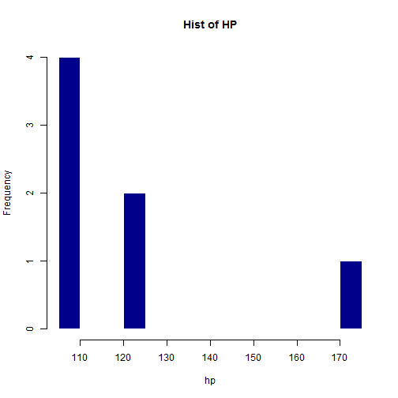

Motor Trend 1973-74 Model Year Automobile Performance Analysis
========================================================
author: Brian - The Grumpy Gator
date: 27 December 2015
transition: rotate
transition-speed: slow


I don't know what kind of car to buy?
========================================================


There comes a time when everyone needs to buy a car from 
the 1973-1974 model year. The problem is, no one knows much
about cars from that era anymore. 

If that person is you, your problem is now solved!

Motor Trend Magazine (not associated with the actual Motor
Trend Magazine) has got just the app for you (because, you
know, everyone just loves apps)

Motor Trend (not Motor Trend) can help!
========================================================
incremental: true

Our Automobile performance app will help you make your 
purchasing decision easier thanks to reactive computations 
of every automobile's (well, 32 cars from the 1973-74 model
year) key statistics:
- Mean HP (horse-power)
- Mean Engine Displacement
- Mean Fuel Mileage (mpg)
- Mean Vehicle Weight

All you have to know is how many cylinders you want in your
engine and we'll show you the best cars for your choice!

How do I do this, you ask?
========================================================

- Start by using the Shiny slider to select the desired
nuber of cylinders
- Choose 4 if you want 4-cylinder cars (or 6 or 8 -- that's
all they had in 1973-74)


Once you've chosen, Shiny will use R (it's R, so you know
it's awesome, right?) to compute the statistics like:


```r
round(mean(mtcars[mtcars$cyl == 6, ]$hp),2)
```

```
[1] 122.29
```
The above will compute the mean horse-power for 6-cylinder cars. 
Other statistics computed in a similar way where 6 would
be replaced by the user's choice of cylinders.

Pretty Graphics (trademark)
===

<small>In addition to the totally correct and useful statistics
computed, the app also displays some Pretty Graphics 
(trademark). The histogram below will definitely help you buy
with confidence. Other metrics are displayed on similar histograms
when using the app.</small>
 


